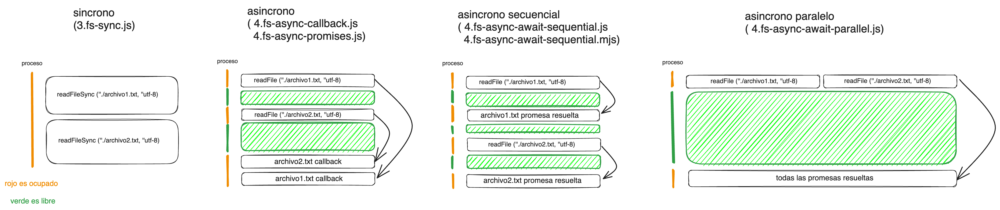

# Curso de Node.js ❇️

Ejercicios del curso practico de Midudev https://twitch.tv/midudev

## 📹 Video de la clase

- 01: [Introducción a Node.js y módulos](https://www.youtube.com/watch?v=yB4n_K7dZV8)
